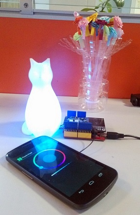
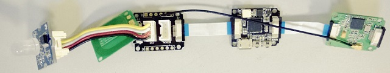

Touch Pixel
===========

To colorize a colorful pixel with a simple touch using nfc technolgy

  

### DIY a Touch Pixel using mbed platform
+ Hardware - [Arch][Arch] + [NFC Shield V2][NFC Shield V2] + Grove - Chainable RGB LED
+ Software - http://mbed.org/users/yihui/code/TouchPixel/

----------------

### using Arduino
+ Hardware - Seeeduino V3 + [NFC Shield V2][NFC Shield V2] + Grove - Chainable RGB LED or Xadow Main board + [Xadow NFC][Xadow NFC] + Xadow Breakout + Grove - Chainable RGB LED
  
  

+ Software
  + [for Seeeduino V3](arduino/touchpixel.ino)
  + [for Xadow](arduino/touchpixel_xadow.ino)

[Xadow NFC]: http://goo.gl/rRQ56V
[NFC Shield V2]: http://goo.gl/XPf6XY
[Arch]: http://goo.gl/Zh2Azz

